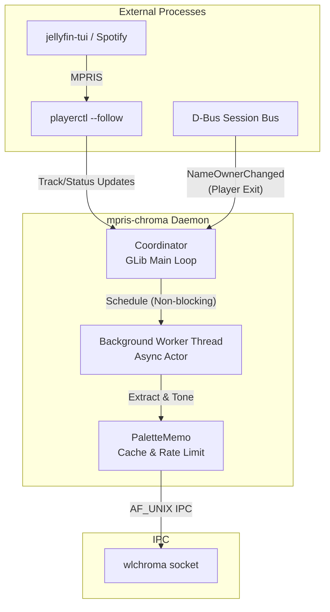

# mpris-chroma

## Overview & Problem Statement
`mpris-chroma` is an event-driven background service that dynamically synchronizes desktop aesthetics to active media playback without relying on CPU-intensive polling. By leveraging a single-instance GLib main loop, D-Bus event listening, and an asynchronous actor model, it coordinates real-time album art extraction and applies perceptual color transformations over low-level IPC. It was built to solve the performance and lifecycle issues typical of polling-based desktop customization scripts, ensuring strict zero-polling operation and seamless state reversion when media players exit.

## Architecture & System Design



### Core Design Decisions
* **Zero-Polling & Event-Driven**: The coordinator operates purely on external events. Media metadata is streamed via `playerctl --follow`, while process lifecycle events are trapped via D-Bus `NameOwnerChanged`.
* **Asynchronous Actor Model**: Heavy operations like I/O, network requests, and image processing run on an isolated worker thread. The main GLib loop is strictly non-blocking and handles state transitions only.
* **Bounded Caching & Coalescing**: Requests are coalesced so only the newest state is processed. The `PaletteMemo` cache is LRU-bounded (128 MiB / 512 entries), preventing unbounded memory growth over prolonged uptime.
* **Low-Level IPC**: Recoloring instructions are sent directly to the `wlchroma` UNIX domain socket via lightweight IPC, bypassing shell invocation overhead and preventing zombie processes.

## Key Features & Technical Hardening

* **Oklab Perceptual Toning**: Employs the Oklab color space to map extracted hues into predefined lightness and chroma envelopes. This guarantees accessible contrast and vibrancy ratios across both dynamically detected light and dark modes, avoiding muddy outputs or blown-out highlights.
* **Systemd Security Sandboxing**: Shipped with a highly restricted user unit relying on `ProtectSystem=strict`, `NoNewPrivileges=yes`, `PrivateDevices=yes`, and `ProtectHome=read-only`. Write access is exclusively limited to a dedicated cache directory.
* **Stream Protection & Network Isolation**: Downloading remote artwork utilizes strict bounds. The HTTP client implements fixed timeouts, size ceilings, and stream validation to mitigate SSRF (Server-Side Request Forgery) and DNS rebinding attacks.
* **Fail-Safe Transitions & Fault Tolerance**: Network failures trigger a capped exponential backoff retry cycle. If a process exits abruptly, D-Bus listeners guarantee the service reverts gracefully to the base desktop palette, preventing stale UI states.

## Testing & Verification
This repository prioritizes reliability and correctness through a comprehensive 319+ test suite. The test coverage validates pure logic states, thread coordination, cache eviction, and handles edge-case file mutations and adversarial bounds checks without requiring a live Wayland session.

To run the test suite locally:

```bash
# Install dependencies using the pyproject.toml definitions
# Pillow is required for testing image extractions
pip install -e .

# Run the standard unittest suite
python -m unittest discover -s tests -v
```

## Quickstart / Installation

### Prerequisites
* Python 3.11+
* Dependencies: `PyGObject`, `dbus-python`, `Pillow`
* System packages (for Debian/Ubuntu): `python3-gi`, `python3-gi-cairo`, `python3-dbus`, `gir1.2-glib-2.0`, `libgirepository1.0-dev`, `libcairo2-dev`, `libdbus-1-dev`
* `playerctl` and an active `wlchroma` instance running.

### Installation
The service assumes this repository is cloned at `~/mpris-chroma` and the `wlchroma` binary is accessible.

```bash
# Clone the repository
git clone https://github.com/dhonus/mpris-chroma.git ~/mpris-chroma
cd ~/mpris-chroma

# Install the systemd user service and reload the daemon
./install.sh

# Verify the service is running
systemctl --user status mpris-chroma
journalctl --user -u mpris-chroma -f
```

To remove the service and revert to the default palette, run `./uninstall.sh`.
